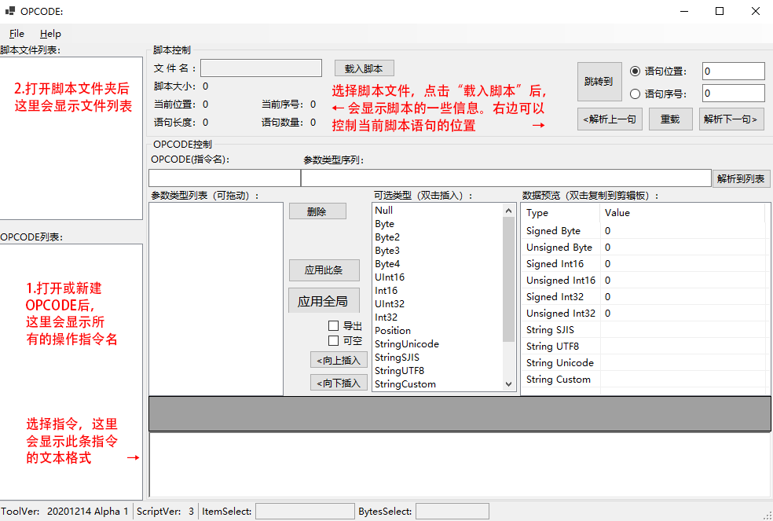
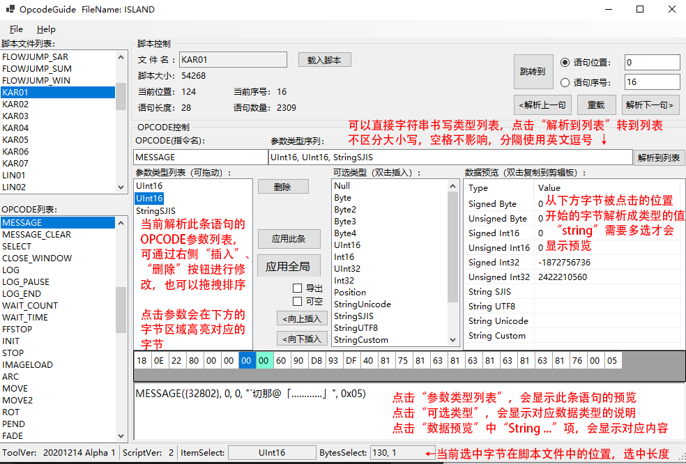

# OpcodeGuide使用说明
## 简介
OpcodeGuide是用于制作LucaSystemTools中脚本导出所用到的OPCODE文件的一个可视化工具。
## 窗体说明

载入脚本后：

## 快速上手

1. File->New/Open Opcode打开或新建一个OPCODE  
    新建时，需要先选择**游戏引擎的版本号**，具体版本号可根据发售日期和平台推测
2. File->Open Script选择解压后的游戏脚本文件夹  
    注：此文件夹中必须**只能含脚本**文件，不能包含其他无关文件
3. 选择左侧"**脚本文件列表**"中的文件名，点击"**脚本控制**"中的"**载入脚本**"按钮，即可载入脚本
4. 打开脚本后自动载入第一句脚本，使用“**解析下一句**”到需要修改的语句
5. 在下方字节预览窗口中选择字节，“**数据预览**”中会显示对应的值
6. 选择“**可选类型**”中的可用类型，“**向上插入**”或“**向下插入**”到“**参数类型列表**”中
7. 点击“**应用此条**”，即可在下方预览编辑框中看到解析的效果
    如果有问题，点击“**脚本控制**”中的“**重载**”即可还原
    如果无问题，点击“**应用全局**”即可重载此脚本，若出错，则可能需要在插入类型时勾选“**可空**”
9. File->Save/Save As保存已经“**应用全局**”的OPCODE
9. 使用此OPCODE.txt，配合LucaSystemTools即可导出需要数据